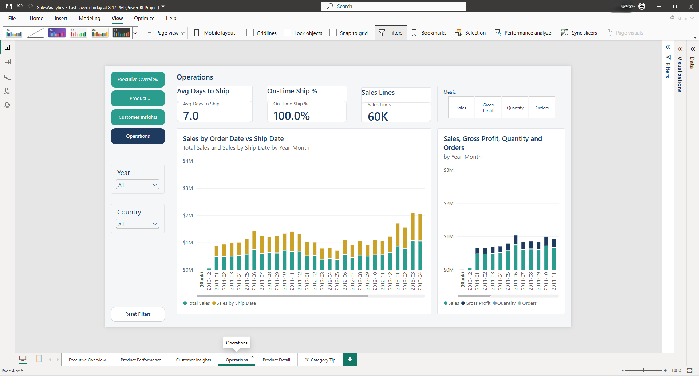
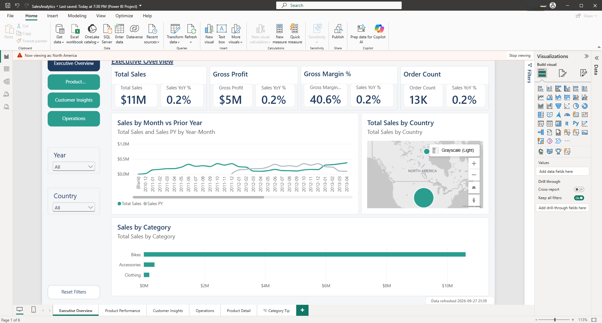

# 📊 Power BI Sales Analytics Report

A full Power BI semantic model and 6-page interactive report built on top of a SQL Server Medallion
warehouse's Gold layer — turning a star schema into drillable, filterable sales analytics with
row-level security.

This repo holds only the Power BI layer. The SQL Server data warehouse it connects to — schemas,
load procedures, quality checks, and the Gold views this model imports from — lives in the
companion repo: [Kenncobby/SQL-Server-Data-Warehouse](https://github.com/Kenncobby/SQL-Server-Data-Warehouse).


**Architecture:** CSV (ERP, CRM) → Bronze → Silver → Gold (star schema) → Power BI semantic model → Report

## Report gallery

| Page | Preview |
|---|---|
| Executive Overview |  |
| Product Performance |  |
| Customer Insights |  |
| Operations |  |

Plus a Product Detail drill-through page and a Category Tip report-page tooltip (not pictured above).

## Model


Star schema: `Fact Sales` at the center, joined to `Dim Customer`, `Dim Product`, and `Dim Date` (5
relationships — Order Date is active; Shipping Date and Due Date are inactive, switched in via
`USERELATIONSHIP` for ship-date measures). `Dim Date` is a marked date table with calendar and
fiscal-year hierarchies (fiscal year starts in July, named by its end year — e.g. Jul 2012–Jun 2013
= FY2013). Full table/relationship detail lives in the companion repo's
[`docs/data_catalog.md`](https://github.com/Kenncobby/SQL-Server-Data-Warehouse/blob/main/docs/data_catalog.md#power-bi-semantic-model).

## Measures

30+ DAX measures across base aggregations, customer analytics, calendar and fiscal time
intelligence, operations, and ranking. Five representative ones:

**Total Sales**
```DAX
SUM ( 'Fact Sales'[Sales Amount] )
```

**Gross Margin %**
```DAX
DIVIDE ( [Gross Profit], [Total Sales] )
```

**Sales YoY %**
```DAX
DIVIDE ( [Total Sales] - [Sales PY], [Sales PY] )
```

**Top N Sales**
```DAX
VAR _n = [Top N Value]
RETURN IF ( [Product Rank] <= _n, [Total Sales] )
```

**New Customers**
```DAX
VAR _minDate = MIN ( 'Dim Date'[Date] )
VAR _maxDate = MAX ( 'Dim Date'[Date] )
VAR _custFirst =
    ADDCOLUMNS (
        VALUES ( 'Fact Sales'[Customer Key] ),
        "@FirstOrder", CALCULATE ( MIN ( 'Fact Sales'[Order Date] ), REMOVEFILTERS ( 'Dim Date' ) )
    )
RETURN
    COUNTROWS ( FILTER ( _custFirst, [@FirstOrder] >= _minDate && [@FirstOrder] <= _maxDate ) )
```

Full catalog: [`docs/powerbi_measures.md`](docs/powerbi_measures.md).

## Security

Three static row-level security roles filter `Dim Customer[Country]`: `North America` (United
States, Canada), `Europe` (Germany, United Kingdom, France), `Pacific` (Australia) — tested via
*Modeling → View as* (see [`docs/powerbi_qa_checklist.md`](docs/powerbi_qa_checklist.md)):



**Production extension (not built):** a dynamic RLS pattern using a `Security User Country` bridge
table and `USERPRINCIPALNAME()` to map signed-in users to allowed countries automatically, instead
of manually assigning users to static roles in the Service.

## How to run

1. Set up and load the warehouse per the instructions in the
   [companion repo](https://github.com/Kenncobby/SQL-Server-Data-Warehouse):
   ```sql
   EXEC bronze.load_bronze @dataset_path = '<your path>\datasets';
   EXEC silver.load_silver;
   ```
2. Open `powerbi/SalesAnalytics.pbip` in Power BI Desktop (2.157.1354.0 64-bit, August 2026, or later).
3. In *Transform data → Manage Parameters*, set `ServerName`, `DatabaseName`, and
   `FiscalYearStartMonth` (7 = fiscal year starts in July) to match your environment.
4. Refresh.

## Skills demonstrated

| Skill area | Where it shows up |
|---|---|
| Prepare data | Power Query parameters, type transforms, fiscal-year calculated columns |
| Model data | Star schema (1 fact, 4 dimensions), 5 relationships incl. 2 inactive `USERELATIONSHIP` paths, marked date table, hierarchies, sort-by columns |
| DAX | 30+ measures incl. time intelligence, RANKX ranking, Pareto cumulative %, a calculation group, a field parameter |
| Visualize | 6 report pages incl. drill-through, report-page tooltip, bookmarks, synced slicers, mobile layout |
| Secure & deploy | 3 static RLS roles tested via View as; dynamic RLS documented as a production extension |
| Optimize | Performance Analyzer pass ([`docs/powerbi_performance.md`](docs/powerbi_performance.md)) — every visual under 1s |

## Data notes

2013 accounts for 87% of all sales lines (52,782 of 60,398), so any 2013-vs-2012 YoY comparison
shows outsized growth — a property of the sample dataset, not a modeling error. 19 sales lines have
an invalid/blank order date (excluded from year-over-year breakdowns, included in "all data"
totals); every fact row has a valid customer and product key, so there are zero orphan lines. Full
baseline: [`docs/powerbi_reconciliation_results.md`](docs/powerbi_reconciliation_results.md).

## Author

Kenneth Appiah — SQL Developer specializing in database design, query optimization, and ETL solutions.

## License

MIT — see [LICENSE](LICENSE).
